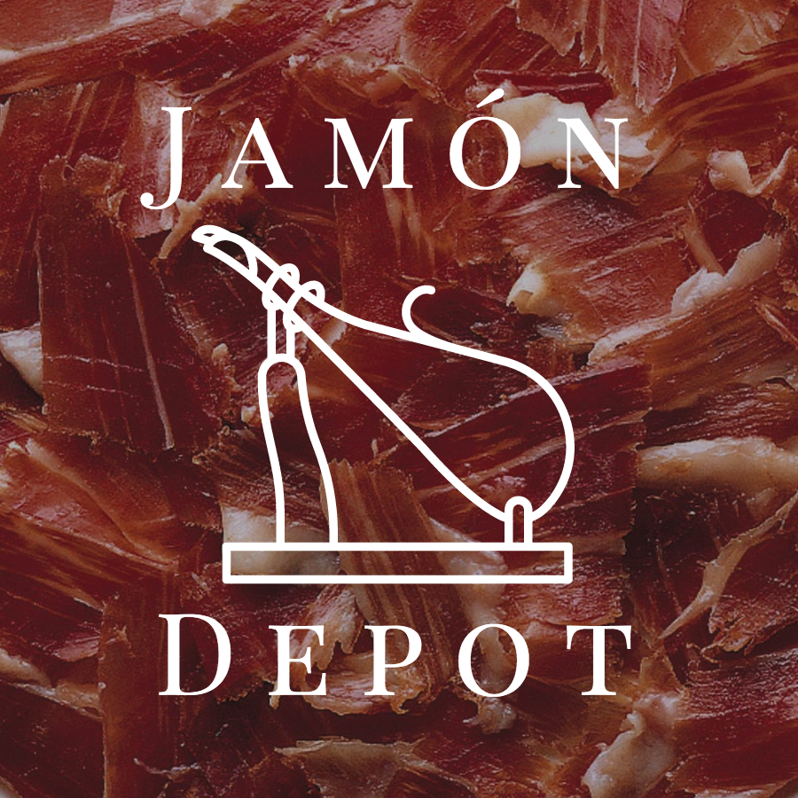

# Jamón Depot

######
[Live Project](http://jamondepot.club/#/)   |   [Overview](https://github.com/johnnycopes/ecommerce_website/#overview)   |   [What I Used](https://github.com/johnnycopes/ecommerce_website#what-i-used)   |   [MVP](https://github.com/johnnycopes/ecommerce_website#mvp-minimum-viable-product)   |   [Challenges](https://github.com/johnnycopes/ecommerce_website#challenges--solutions)   |   [Code](https://github.com/johnnycopes/ecommerce_website#code-snippets)   | [Screenshots](https://github.com/johnnycopes/ecommerce_website#screenshots)   |

## Overview:


## What I used:
**Languages/Frameworks:**
* HTML5
* CSS
* AngularJS
* Python/Flask
* PostgreSQL

**Other:**
* Stripe API
* Logo icon from [Freepik](http://www.flaticon.com/search?word=spanish%20food/)


## MVP (Minimum Viable Product):


**Initial MVP**


**Stretch Goals**

## Challenges & Solutions:

1.  **Challenge:**

    **Solution:**

2.  **Challenge:**

    **Solution:**

3.  **Challenge:**

    **Solution:**

4. **Challenge:**

    **Solution:**


## Code Snippets

(First example):
```
```

(Second example):
```
```

(Third example):
```
```

## Screenshots


********
